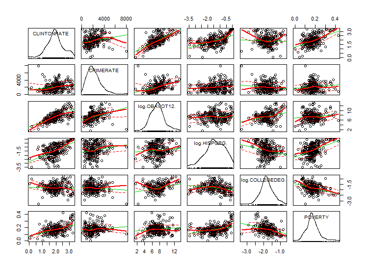
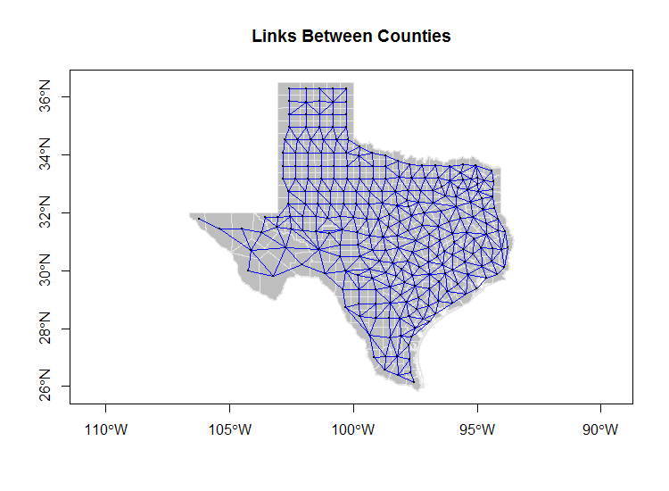
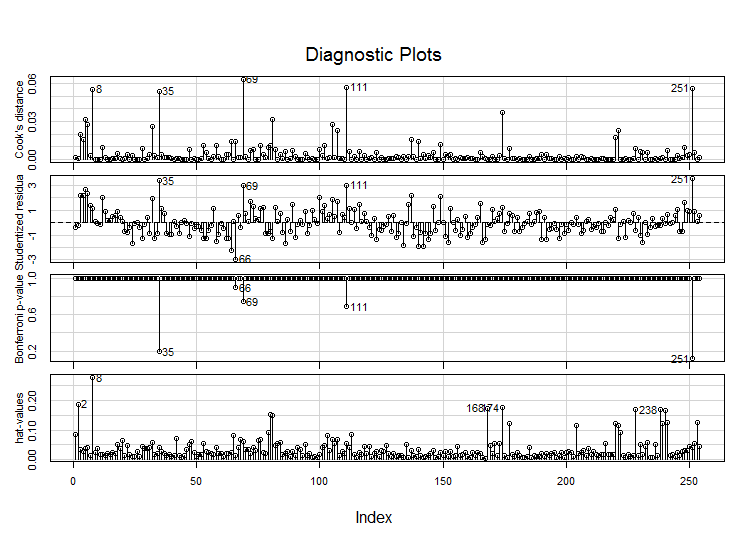

# Spatial Statistics - Linear Regression in R
### Executive Summary
This was the code I prepared and used for my qualifying exams for the Geospatial Information Sciences program. Our task was to build a spatially adjusted linear regerssion from the 2016 voting data for Texas counties. If it sounds like an impossible or irrational task, it was. The idea was just to check our understanding and methodology based on two semesters of basic and advanced statistics for geospatial analysis. The list of review topics (mind you, not the topics actually explained) was 6 pages long.
### Files Included
* QualifierTemplate.R - the code I prepared for the exam. There's not enough time to write it all from scratch even if you could.
* BurnsQual.R - the code I turned in.
* 20180510 Burns Qualifier Data Analysis.pdf - the tasks assigned that generated the code along with my code and plot outputs.
* HelperFunctions.R - the code we were supplied and expected to use.
* A few of the plots are included.
### Methodology
We were to select and transform at least 5 features, build a linear model, and adjust it for spatial autocorrelation. To sum up the outcome, you would expect to see the urban areas mostly voting for Clinton and the rural areas voting for Trump. We selected features accordingly. We were instructed to use the voting results for each, the population, and consider the registered voters and turnout rate.

The features I selected were crime rate, Obama voting rate, Hispanic population, college education, poverty rates, and urban/rural. My rational for using crime was the research showing that cities scales at a rate of 15% efficiency gain with size. That applies to crime as well. My professor didn't buy it even though [I cited sources](https://medium.com/the-long-now-foundation/why-cities-live-forever-3cd451c0c48d). 
### Discussion
The main mistake I made on this exam was that I transformed the voting rate incorrectly which was the target variable. I made that mistake at the beginning and it made everything else wrong. We were taught to log transform skewed data to make it more normally distributed but we weren't told not to do that to percentages. I've since learned you're supposed to do a more complicated transformation that we didn't cover if you actually care about the shape of the data.

I'll show the scatterplot matrix here because I like those:

Another issue with this test is that to adjust for spatial autocorrelation, we draw this network:

That allows R to follow the links to understand what is connected to what. The problem is that it assumes that things are related just because they are next to each other - which is a silly assumption in this instance. The urban/rural factor already accounts for that. And the fact that cities tend to vote Democratic and rural towns Republican was captured in the proxy for city size - crime. It also ignores the fact that geographic places are connected by highways. If we believe geographic proximity is important then we need to account for drive time, not riding a horse in a straight line to the center of each county. 

And then here are some diagnostic plots: 

These are fun because it's easy to visually pick out outliers. Obviously Texas counties have several. The county population is estimated to range between 4.6 million for Harris County (Houston) down to Loving County with 134 people. As of the [2017 census survey](https://en.wikipedia.org/wiki/List_of_counties_in_Texas), there were 8 counties with less than 1000 people which makes the Texas Senate a bit of a joke that 134 country people would have the same representation as 4.6 million city dwellers. It also makes this particular analysis a bit meaningless even if I had done the transformation correctly.
### Results
I failed this qualifier. Funny thing was that out of the 3 of us taking it, 2 failed and the other technically should have failed because he didn't use enough features and took extra time other than what was allotted. So basically no one usually passes this test.

This and the Theories qualifier helped me understand that I didn't really want to do doctoral research with this program. My interests are in the implications of network science on geography and GIS as a field can't accept that network affects exist beyond transportation networks and proximity. It's similar to the state of economics before they realized psychology matters and evolved into behavioral economics.

Hopefully, it goes without saying that if you are a doctoral student about to take your GIS qualifier, don't use this code. You shall not pass. :)